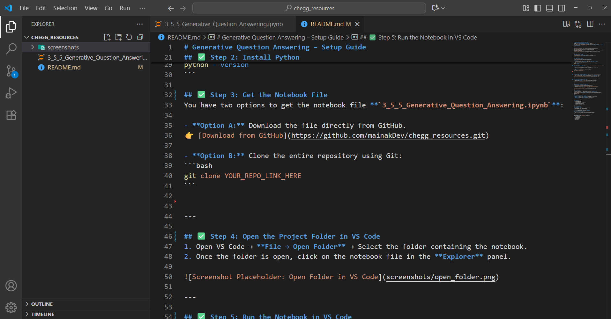
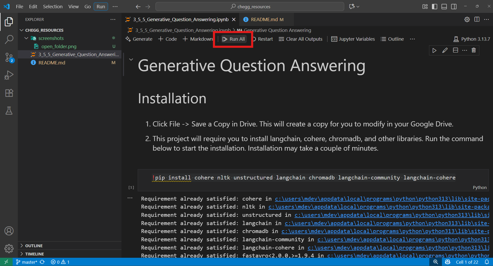
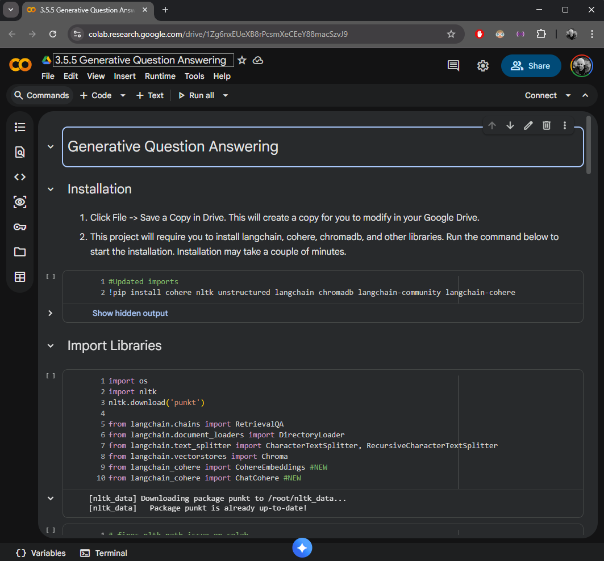

# Generative Question Answering – Setup Guide

Welcome to the **Generative Question Answering** project!
This guide will help you set up your environment and run the Jupyter Notebook **`3_5_5_Generative_Question_Answering.ipynb`** either **locally using VS Code** or **online using Google Colab**.

---

## Quick Links
[](https://code.visualstudio.com/download)  
[](https://www.python.org/downloads/)  
[](https://colab.research.google.com/)  

---

## Step 1: Install VS Code
Download and install **Visual Studio Code** from the official website:  
[Download VS Code](https://code.visualstudio.com/download)

---

## Step 2: Install Python
Download and install **Python (version 3.9 or above)**:  
[Download Python](https://www.python.org/downloads/)


**Important:**  
- During installation, **check the box** that says **"Add Python to PATH"**.
- After installation, verify by running:
```bash
python --version
```

## Step 3: Get the Notebook File
You have two options to get the notebook file **`3_5_5_Generative_Question_Answering.ipynb`**:

- **Option A:** Download the file directly from GitHub.  
[Download from GitHub](https://github.com/mainakDev/chegg_resources.git)

- **Option B:** Clone the entire repository using Git:
```bash
git clone YOUR_REPO_LINK_HERE
```

---

## Step 4: Open the Project Folder in VS Code
1. Open VS Code → **File → Open Folder** → Select the folder containing the notebook.
2. Once the folder is open, click on the notebook file in the **Explorer** panel.



---

## Step 5: Run the Notebook in VS Code
- Click **Run All** or execute cells individually.
- Make sure the **kernel** is set to your installed Python environment.



---

## Alternative Option: Run on Google Colab
If you prefer not to set up VS Code:
1. Go to [Google Colab](https://colab.research.google.com/).
2. Upload the notebook file **`3_5_5_Generative_Question_Answering.ipynb`**.
3. Run the cells directly in Colab.



---

## If Setup Fails
If you face issues with VS Code or Python installation, **don’t worry!**  
You can download the **final folder (db.zip)** which contains everything you need:  
[Download db.zip](https://github.com/Thinkful-Ed/ai-in-web-dev-resources/blob/main/db_updated.zip)

---

## Multiple Ways to Run the Notebook
- **Option 1:** Locally using **VS Code** (recommended for full control).
- **Option 2:** Online using **Google Colab** (quick and easy).
- **Option 3:** Use the **db.zip** folder if setup fails.

---

## Checklist
- [ ] Installed VS Code  
- [ ] Installed Python  
- [ ] Downloaded or cloned the notebook  
- [ ] Opened folder in VS Code  
- [ ] Ran the notebook successfully  

---

## 🔍 Troubleshooting
### 1. Kernel Not Found
- Ensure Python is installed and added to PATH.
- Restart VS Code after installing Python.

### 2. Missing Jupyter Extension
- Go to VS Code Extensions and install **Jupyter**.

### 3. Notebook Cells Not Running
- Check if the correct Python interpreter is selected in VS Code.

---


